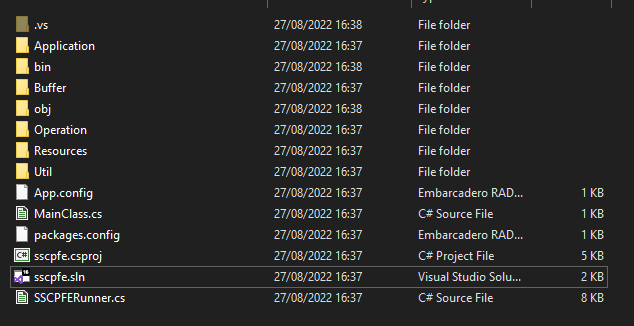
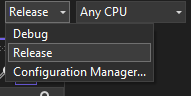
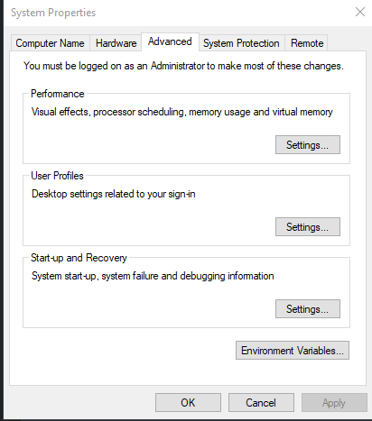
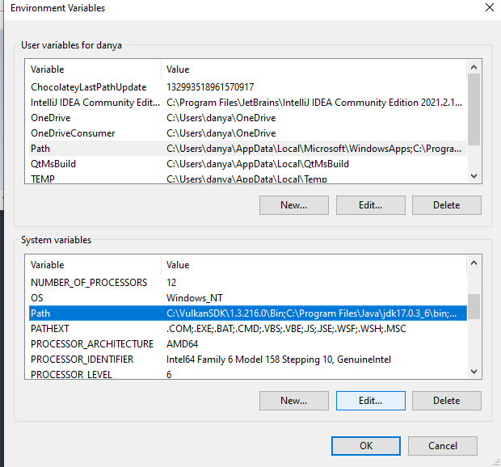
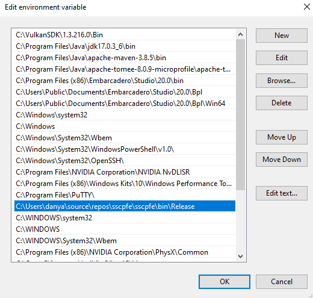

# sscpfe
Super Simple Command Prompt File Editor (sscpfe). 

As it states this application was created to perform file operations in Windows command prompt.

## Introduction (Why?)
Recently I used linux a lot. There are a lot of text console-based editors (vim, nano, etc.).
Later I used Windows again and... you know... notepad.
So I decided to create some sort of nano (my favorite console text editor) editor for Windows.

## Why C#?
Firstly, there are a lot editors for linux and no editors (joke) for Windows. This one is exclusive.<br>
Secondly, why the hell did I learned C# in university?

## Build && install && run

### Build

To build this application you need to copy this repo

```
git clone https://github.com/greentech72/sscpfe.git
```

You will see something like:

```
$ git clone https://github.com/greentech72/sscpfe.git
Cloning into 'sscpfe'...
remote: Enumerating objects: 370, done.
remote: Counting objects: 100% (370/370), done.
remote: Compressing objects: 100% (159/159), done.
remote: Total 370 (delta 272), reused 301 (delta 210), pack-reused 0
Receiving objects: 100% (370/370), 89.11 KiB | 2.17 MiB/s, done.
Resolving deltas: 100% (272/272), done.
```

Then open ```.sln``` file under ```sscpfe``` folder with Visual Studio.



Set necessary options in your Visual Studio project and build in release mode.



In build log you will see something like:
```
Build started...
1>------ Build started: Project: sscpfe, Configuration: Release Any CPU ------
1>  sscpfe -> C:\Users\danya\source\sscpfe\sscpfe\bin\Release\sscpfe.exe
========== Build: 1 succeeded, 0 failed, 0 up-to-date, 0 skipped ==========
```

After that under ```sscpfe``` folder ```obj/Release``` folder will be created. There you can find ```sscpfe.exe``` file witch you can run.

### Install

If you want to be able to use this application from command line like
```
sscpfe
```

and not like
```
path_of_repo/sscpfe/obj/Release/sscpfe.exe
```

You should add path to ```sscpfe.exe``` to your path vars.

Just copy full path and perform next steps.







### Run

After that you can easily check if sscpfe was installed. Just run:

```
sscpfe --help
```

And if you are able to see help message then you're welcome.

